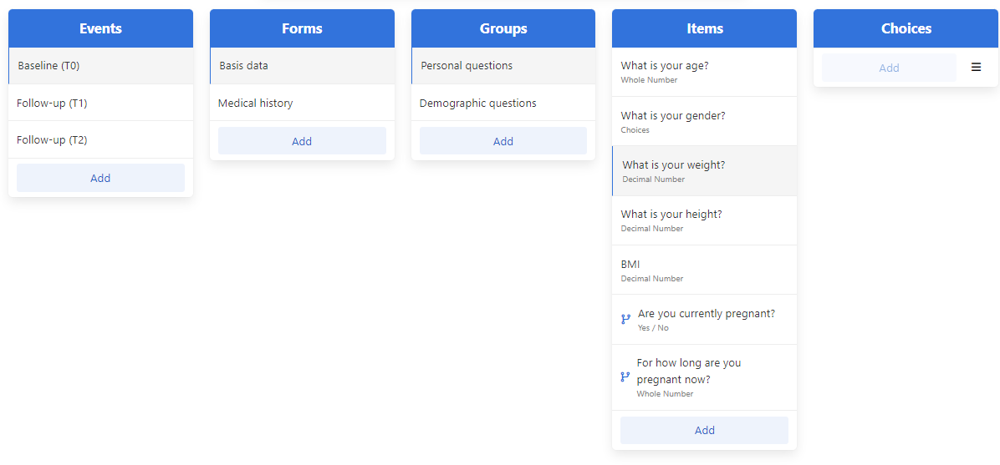

# Question


```xml
<ItemDef OID="Gender" Name="Gender" DataType="text">
    <Question>
        <TranslatedText xml:lang="en">What is your gender?</TranslatedText>
        <TranslatedText xml:lang="de">Welches Geschlecht haben Sie?</TranslatedText>
    </Question>
    <CodeListRef CodeListOID="CL.1"/>
</ItemDef>
```



### BODY

([**TranslatedText**](../../3.1.1.2-basicdefinitions/measurementunit/symbol/translatedtext.md)+)


### ATTRIBUTE

**none**


### CONTAINED IN

****[**ItemDef**](./)****


문서나 화면에 항목에 관한 데이터를 제공하라는 메세지가 표시, 사용자에게 제공하는 라벨이다.

\
